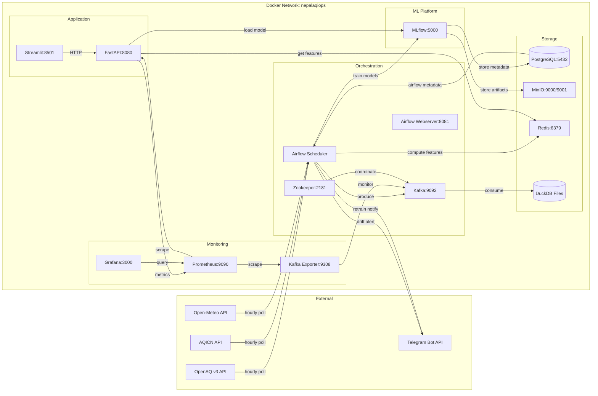

# Architecture

Detailed service interaction diagram for NepalAQI-Ops.

## Service Dependencies (Startup Order)

1. **Zookeeper** → Kafka
2. **PostgreSQL** → Airflow, MLflow
3. **MinIO** → MLflow (artifact store)
4. **Redis** → FastAPI (feature store)
5. **Kafka** → Ingestion DAGs
6. **MLflow** → Training DAGs, FastAPI
7. **Airflow** → All DAGs
8. **FastAPI** → Streamlit
9. **Prometheus** → Grafana

## Data Flow Stages

1. **Ingestion**: Airflow DAGs poll external APIs hourly → publish to Kafka topics
2. **Storage**: Kafka consumers write raw data to DuckDB (Parquet-backed)
3. **Feature Engineering**: Rolling stats, lag features, cyclical encoding, calendar flags, Kriging → Redis
4. **Training**: Weekly full retrain; daily drift check triggers conditional retrain
5. **Serving**: FastAPI loads champion model from MLflow, serves predictions from Redis features
6. **Monitoring**: Prometheus scrapes API metrics; Evidently computes PSI; Grafana visualizes; Telegram alerts
