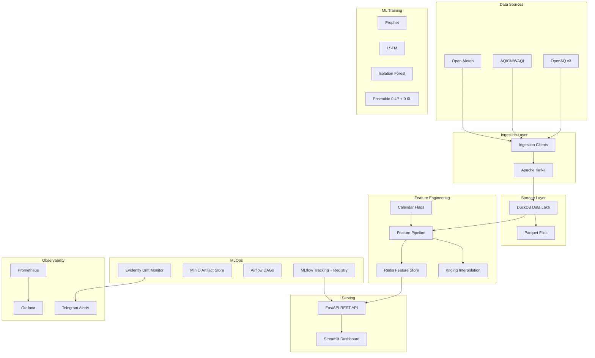
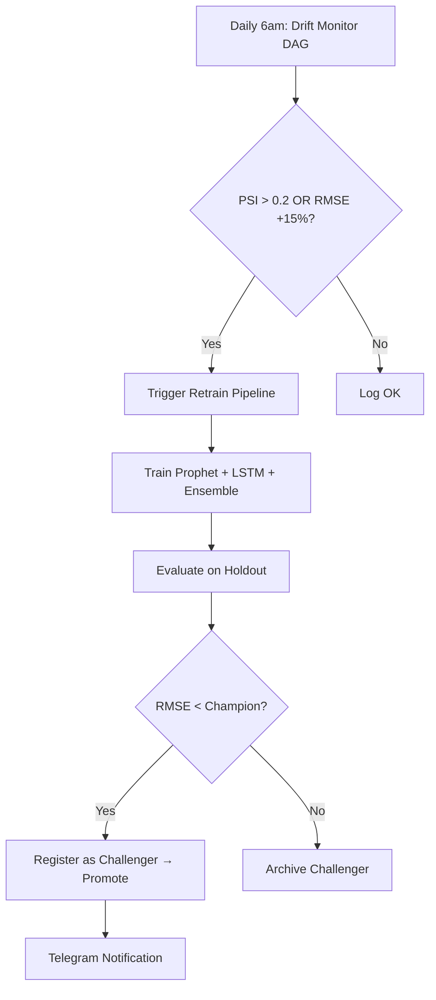

# NepalAQI-Ops

> Production-grade MLOps pipeline for real-time air quality intelligence and forecasting for Kathmandu Valley, Nepal.

## Architecture



## Prerequisites

- Docker & Docker Compose v2.20+
- 8GB RAM minimum (16GB recommended)
- Ports available: 8080, 8501, 9090, 3000, 9000, 5000

## Quick Start

```bash
# 1. Clone and configure
cp .env.example .env
# Edit .env with your API keys (OPENAQ_API_KEY, AQICN_TOKEN, TELEGRAM_BOT_TOKEN)

# 2. Launch all services
docker compose up --build

# 3. Verify
curl http://localhost:8000/health
```

### Service URLs

| Service | URL |
|---------|-----|
| FastAPI | http://localhost:8000 |
| Streamlit Dashboard | http://localhost:8501 |
| MLflow | http://localhost:5000 |
| Airflow | http://localhost:8080 |
| Grafana | http://localhost:3000 |
| Prometheus | http://localhost:9090 |
| MinIO Console | http://localhost:9001 |

## API Reference

### Health Check
```
GET /health → {"status": "ok", "champion_model": "...", "last_retrain": "..."}
```

### Forecast
```
GET /forecast/{station_id}?hours=24
GET /forecast/heatmap → GeoJSON FeatureCollection (32 wards)
```

### Anomalies
```
GET /anomalies/latest → List of recent anomaly detections
```

### Manual Retrain
```
POST /retrain
Headers: X-API-Key: <RETRAIN_API_KEY>
```

### Model Routing
```
Headers: X-Model-Version: challenger  → routes to challenger model
```

## Auto-Retraining Flow



## Data Sources

| Source | Frequency | Auth | Coverage |
|--------|-----------|------|----------|
| OpenAQ v3 | Hourly | API Key | Real-time PM2.5/PM10/NO2 sensors |
| AQICN/WAQI | Hourly | Token | Kathmandu, Bhaktapur, Patan, Lalitpur |
| Open-Meteo | Hourly | None | Temperature, humidity, wind, precipitation |

## Nepal Festival Calendar

The pipeline includes Nepal-specific calendar features that capture AQI-impacting events:

- **Tihar (Diwali)**: Fireworks → severe PM2.5 spikes
- **Dashain**: Increased travel → traffic emissions
- **Indra Jatra**: Street festivals → localized pollution
- **Brick kiln season**: Oct–Apr → sustained elevated PM2.5
- **Monsoon**: Jun–Sep → natural PM2.5 washout

Festival dates (2020–2027) in `features/nepal_festivals.csv`.

## Makefile Commands

```bash
make ingest      # Run one-shot ingestion
make train       # Trigger training pipeline
make drift       # Run drift detection
make test        # Run pytest with coverage
make lint        # Run ruff linter
make up          # docker compose up --build -d
make down        # docker compose down -v
```

## Troubleshooting

| Problem | Solution |
|---------|----------|
| Kafka not starting | Check `KAFKA_ADVERTISED_LISTENERS` in compose; ensure Zookeeper is healthy first |
| MLflow connection refused | Wait for PostgreSQL healthcheck; verify `MLFLOW_BACKEND_STORE_URI` |
| Model prediction NaN | Check Redis for stale features; verify feature engineering ran |
| Airflow DAG not visible | Check `AIRFLOW__CORE__DAGS_FOLDER` mount; restart scheduler |
| MinIO bucket missing | First run creates buckets automatically via `mc mb` in entrypoint |
| High memory usage | Reduce Kafka partitions; lower LSTM batch size |

## Roadmap

- [ ] Multi-city expansion (Pokhara, Biratnagar)
- [ ] Satellite AOD integration (Sentinel-5P)
- [ ] Mobile app push notifications
- [ ] Fine-grained ward-level health advisories
- [ ] Transformer-based model (PatchTST)
- [ ] Real-time streaming inference via Kafka Streams

## Known Limitations

| Limitation | Impact | Mitigation |
|-----------|--------|------------|
| Single-node Kafka (replication factor 1) | Not fault-tolerant — broker crash loses unread messages | Acceptable for dev/demo; production would use RF=3 with 3 brokers |
| DuckDB is single-writer | Concurrent Airflow tasks writing to the same DuckDB file cause lock contention | Serialize writes via task dependencies (`>>` operator); only one writer at a time |
| PSI threshold may be conservative for binary features | Festival flags (`is_tihar`, `is_monsoon`) always flip to 1 during festivals, triggering false drift alerts | Exclude binary features from PSI computation; monitor them with simple change-point detection instead |
| Kriging uses only 4-5 sensors for 32 wards | At the lower bound of Kriging validity; large kriging variance for distant wards | `kriging_variance` field quantifies uncertainty per ward; roadmap includes Sentinel-5P satellite AOD for 100+ grid cells |
| No Kafka consumer process | Data persistence re-fetches APIs instead of consuming from Kafka topics | Kafka serves as audit log and decoupling layer; future iteration will add Faust/Kafka Streams consumer |
